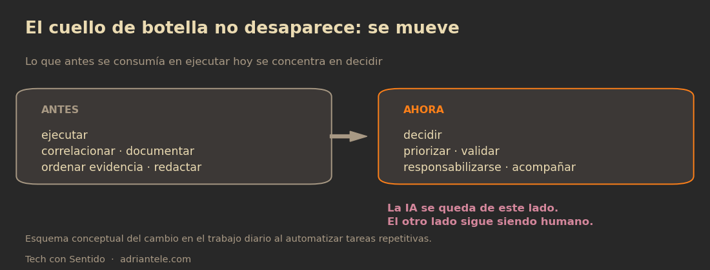

Cuando alguien me dice que el 30 de septiembre se celebra el Día de la IA en el Trabajo, mi primera reacción es la de siempre: ¿de verdad hay algo que celebrar o solo un calendario comercial buscando hashtags?

Fui a verificar, porque no me gusta repetir fechas que no existen.

El día existe, pero tiene dueño. Lo registró LinkedIn, que el 18 de septiembre de 2025 anunció la creación del *National AI at Work Day* y lo celebró por primera vez el 30 de septiembre de ese año. No es un día de la ONU ni de la UNESCO, no es feriado en ningún país y no lo declaró ninguna autoridad: es una fecha del calendario comercial estadounidense que se repite cada año, promovida por una plataforma que vive de que la gente hable de trabajo dentro de esa plataforma.

Dicho eso, la pregunta que empuja me parece legítima. El National Day Calendar describe la fecha con el dato que LinkedIn usó como bandera: en un estudio global patrocinado por la propia compañía, más de 40 por ciento de los profesionistas dijo sentirse rebasado por la velocidad con la que se espera que adopte IA. Cuatro de cada diez personas con un trabajo que quieren conservar, sintiendo que el piso se mueve.

Eso no es *marketing*. Eso es gente con miedo, y conozco ese miedo porque yo también lo tuve.

## Qué cambió en mi trabajo técnico

Soy ingeniero de telecomunicaciones y coordino un equipo de operaciones de voz en el core de una operadora en México. Cuando digo "core de voz", la gente imagina antenas; en realidad es la capa que hace que una llamada se establezca, se mantenga y se facture, y buena parte del trabajo diario consiste en mirar mucha información para decidir rápido qué está fallando.

Ahí la IA no reinventó nada de un día para otro. Entró por la puerta menos glamorosa: quitar trabajo repetitivo. Correlacionar eventos de varias fuentes, armar el borrador del reporte de un incidente, ordenar la evidencia con una línea de tiempo, revisar si dos alarmas son la misma falla vista desde dos lugares distintos, traducir un procedimiento escrito en una checklist.

Lo que antes era una hora de consola hoy es cosa de minutos. Y esos minutos no se convierten en más tareas: se van a lo que sí necesita criterio, que es decidir, priorizar y acompañar al equipo.

Hay un matiz importante que conviene decir en voz alta: trabajo con datos reales de operación, y esos datos no salen de la red de la compañía. Lo que se puede contar hacia afuera es el método, no los números. Cualquiera que use IA en un entorno crítico debería tener esa misma línea clara, y ojalá que la conversación del próximo 30 de septiembre incluya algo de eso, porque el día está lleno de casos de oficina y muy vacío de casos con datos sensibles.

## Lo que no me esperaba: el alcance

Si la IA solo me hubiera quitado trabajo repetitivo, este artículo no tendría gracia. Lo que no esperaba fue lo que pasó del otro lado: en mi tiempo personal, el alcance.

Trabajo de 9 a 6, tengo familia, y mis horas útiles para proyectos propios son dos o tres al día. Con ese presupuesto, hace un año yo no cabía en lo que hoy sostengo: una plataforma de tarjetas de presentación digitales con NFC y QR que ya está en producción y vendiendo, la aplicación de bienestar para mascotas de mi esposa (que es veterinaria), un blog de divulgación que ya va en más de ochenta artículos, dos libros en proceso y un par de ideas en validación.

No lo hago solo, y quiero ser preciso en cómo lo digo porque de esto se habla mucho y se explica poco: trabajo con un asistente de IA que conoce mis proyectos, mis criterios y mi tono, y que documenta, redacta, investiga, corre números y automatiza. Yo pongo la dirección, el juicio y la responsabilidad; él pone la velocidad. Es la diferencia entre tener un equipo y tener un empleado imaginario: lo que no delego nunca es la decisión.

Tampoco es magia ni diez veces más productividad. Es más chiquito y más real: dejé de gastar mi mejor hora del día en tareas que no pedían mi criterio. Esa hora, multiplicada por meses, es el proyecto que sí salió.

## Lo que la IA no hace (y por eso sigo decidiendo yo)

Después de un año trabajando así, mi lista de lo que la IA no hace creció más que la de lo que sí hace.

No decide qué es importante. No se hace responsable de una falla en la red. No se sienta con el ingeniero que lleva tres noches de guardia. No distingue entre un dato verificado y uno que suena bien: eso lo tengo que hacer yo, siempre, y en un entorno operativo una cifra inventada no es un error simpático, es un incidente.

También descubrí el costo que casi no se menciona: la IA acelera la producción, y con eso acelera la cantidad de cosas que necesitan revisión, discusión y decisión humana. El cuello de botella no desaparece, se mueve. Antes estaba en ejecutar; ahora está en decidir, y ahí no hay atajo que me libre del trabajo de pensar.

Ese, para mí, es el marco honesto del Día de la IA en el Trabajo: no es el día en que la máquina nos reemplaza ni el día en que nos volvemos genios. Es el día en que conviene preguntarnos qué parte de nuestro trabajo era criterio y qué parte era trámite.

## La parte incómoda para América Latina

El dato del 40 por ciento viene de un estudio global, y en América Latina sospecho que el malestar es más grande por una razón sencilla: la conversación llegó en inglés, con casos de Silicon Valley, precios en dólares y conexiones que aquí no siempre existen.

En la región, "usar IA" todavía sonaba, hace muy poco, a que te van a reemplazar; no a que te van a dar alcance. Y hay una brecha que el discurso de las plataformas no toca: no todo profesionista mexicano puede pagar veinte dólares al mes, no todos tienen una computadora libre para experimentar y no todos trabajan en empresas que toleran que pruebes cosas nuevas.

Si el acceso a estas herramientas depende de poder pagar en dólares y de saber inglés, la fecha del 30 de septiembre va a seguir siendo un evento para unos cuantos y una amenaza para el resto. Y ese, otra vez, es el mismo patrón de siempre: la tecnología llega, pero llega primero a quien ya estaba adelante.

Mi postura es sencilla, y es la razón por la que escribo esto: la IA no es el enemigo del trabajo, es el enemigo del trabajo repetitivo. Lo que hay que defender no es el puesto, es el criterio. Y si algo aprendí este año es que el criterio sigue siendo humano, incluso cuando la herramienta ya no lo es.

El progreso no guiado por el humanismo no es progreso.

Y ustedes, ¿qué tarea de su semana dejarían de hacer hoy mismo para dedicarse a lo que nadie más puede hacer por ustedes?

## Fuentes

- Checkiday, [National AI at Work Day](https://www.checkiday.com/bb97cc2df9b9be413e5715a15b7ab510/national-ai-at-work-day): fundado por LinkedIn el 18 de septiembre de 2025, se observa cada 30 de septiembre desde 2025.
- National Day Calendar, [National AI in Work Day](https://nationaldaycalendar.com/national-ai-at-work-day-september-30/): origen de la fecha, público objetivo y el dato del estudio global patrocinado por LinkedIn (más de 40% de profesionistas rebasados por la velocidad de adopción).
- LinkedIn News, [LinkedIn celebra el primer Día Nacional de la IA en el Trabajo](https://news.linkedin.com/2025/linkedin-celebrates-first-national-ai-in-work-day) (septiembre de 2025), anuncio de la fecha citado por las dos fuentes anteriores.

*Nota metodológica: el Día de la IA en el Trabajo no es una fecha oficial de ningún organismo internacional; es un día registrado en calendarios comerciales de Estados Unidos e impulsado por LinkedIn. La cifra de más de 40 por ciento proviene de un estudio global patrocinado por LinkedIn que no pude consultar de forma directa: la cito atribuida a National Day Calendar, que la reproduce, y no la presento como dato independiente. Los ejemplos de mi trabajo técnico son descripciones de métodos, sin cifras ni datos de operación de la compañía donde trabajo.*

*Si te interesa cómo está armado el asistente con el que trabajo día a día, lo conté con detalle en [Cómo funciona mi agente IA (contado por mi agente IA)](/blog/como-funciona-mi-agente-ia-contado-por-mi-agente-ia/).*
