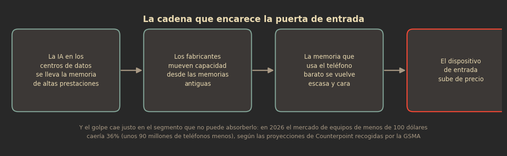

Durante años, cerrar la brecha digital significó una sola cosa: desplegar redes. Llevar cobertura. Yo me formé en eso y he trabajado buena parte de mi carrera en que la señal llegue.

Por eso me incomodó tanto lo que leí esta semana en TeleSemana, a partir del informe que la GSMA publicó con datos de Counterpoint Research. Resulta que la brecha digital cambió de naturaleza justo cuando parecía que lo único que faltaba era tiempo y antenas: ahora se está encareciendo la puerta de entrada, y el responsable no es un operador ni un gobierno, sino la carrera por la inteligencia artificial.

## La brecha ya no se explica por falta de antenas

Los números del informe son claros. A finales de 2025, unos 4,800 millones de personas usaban internet móvil desde un dispositivo propio, mientras 3,400 millones seguían sin hacerlo. Lo interesante es dónde vive esa gente: más del 90 por ciento de quienes no se conectan ya está bajo cobertura de banda ancha móvil. En total, 3,100 millones de personas tienen una red disponible y no la usan.

Ese es el dato que rompe el relato viejo. La brecha de uso —no la de cobertura— es la que manda hoy, y la principal barrera declarada para cerrarla es la más terrenal de todas: no tener con qué conectarse. El dispositivo.

## La memoria se volvió un recurso escaso

Aquí entra la IA, y entra por un camino poco evidente: por el precio de la memoria.

Los centros de datos de IA consumen memoria de altas prestaciones a un ritmo brutal. Los fabricantes responden moviendo capacidad de producción desde tecnologías de memoria más antiguas —las que todavía usa la gama de entrada— hacia productos de mayor rendimiento. Según los datos de Counterpoint incorporados al informe de la GSMA, los precios de la memoria ya se habían más que duplicado entre el tercer trimestre de 2025 y el primero de 2026, y volvieron a subir entre 80 y 90 por ciento durante el segundo trimestre.

Vale la pena ser justos con el diagnóstico: no es un solo movimiento, son dos combinados —crece la demanda de memoria para IA y se desplaza la producción de la memoria vieja— y los dos golpean el mismo punto de la cadena. La consecuencia es fácil de contar y difícil de pelear: la memoria dejó de ser un componente que se abarata con el tiempo.

## El golpe cae donde no hay margen

En un teléfono de gama baja, con precio mayorista por debajo de 200 dólares, la memoria ya representa casi la mitad del costo de materiales. Su peso se ha más que duplicado desde comienzos de 2025. Y aquí está el detalle incómodo: en la gama alta los márgenes absorben el golpe, en la entrada no existen. Así que el aumento se traslada completo al precio final.

El ejemplo que usa la GSMA es el del Xiaomi Redmi A7, que salió al mercado en abril de 2026 en unos 110 dólares: aproximadamente 40 por ciento más que el Redmi A5 lanzado un año antes, con hardware prácticamente idéntico y mejoras limitadas de software. En India, el Realme C71 había salido por unas 7,699 rupias —unos 80 dólares— y después subió hasta 12,999 rupias, alrededor de 135 dólares.

Treinta o cincuenta dólares más puede parecer una corrección asumible desde un mercado desarrollado. En los mercados donde vive la población todavía desconectada, esa diferencia decide si alguien compra el dispositivo o se queda fuera de internet otro año.

| Qué | Dato |
| --- | --- |
| Precios de la memoria | Más que se duplicaron entre Q3-2025 y Q1-2026; +80–90% adicional en Q2-2026 |
| Memoria en un equipo de menos de 200 USD | Casi la mitad del costo de materiales; más que duplicó su peso desde inicios de 2025 |
| Redmi A7 (abril 2026) | ~110 USD, ~40% más que el Redmi A5 un año antes, con hardware casi idéntico |
| Realme C71 en India | De 7,699 rupias (~80 USD) a 12,999 rupias (~135 USD) |
| Envíos globales de smartphones en 2026 (proyección) | −14%: 174 millones de equipos menos |
| Segmento de menos de 100 USD | −36%: unos 90 millones de equipos menos |
| África subsahariana | 16 millones de smartphones menos en el año (−más de una cuarta parte) |
| Terminal básico con internet | 44% del ingreso mensual medio del 20% más pobre (África subsahariana: 76%) |
| Brecha de uso | 3,100 millones de personas con cobertura móvil que no usan internet móvil |

*Cifras del informe de la GSMA con datos de Counterpoint Research, recogidas por TeleSemana y Euronews. Envíos y segmentos: proyecciones de Counterpoint para 2026.*

## Qué significa esto en México y América Latina

El promedio mundial esconde el problema, otra vez. En los países de ingresos bajos y medios, un terminal básico con acceso a internet equivalía al cierre de 2025 al 44 por ciento del ingreso mensual medio del 20 por ciento más pobre de la población. En África subsahariana, esa relación llegaba al 76 por ciento. No estamos hablando de un gasto discrecional: es una fracción enorme del ingreso de quien menos tiene.

En México el efecto ya se está midiendo. En marzo de 2026, IDC advirtió que los precios de los smartphones podrían subir hasta 14 por ciento durante el año por la crisis de memoria, y que el impacto caería sobre todo en la gama media y de entrada, con efecto directo en mercados sensibles al precio como el mexicano y el latinoamericano. En julio, Expansión documentó el mismo fenómeno en el mercado local.

Aquí hay una diferencia que desde Europa o Estados Unidos se pierde de vista: en buena parte de nuestra región el teléfono no es un accesorio, es la única puerta. No hay una laptop de respaldo ni una computadora en casa; muchas veces hay un solo equipo compartido entre varios miembros de la familia, con recargas de prepago y presupuestos semanales. Cuando el piso de precio de esa puerta sube 40 por ciento, no se posterga una compra de conveniencia: se posterga el acceso a la banca digital, a la educación en línea, a los servicios de salud y al trabajo remoto.

## Los números que vienen

Counterpoint espera que los envíos mundiales de smartphones caigan 14 por ciento en 2026, esto es, 174 millones de dispositivos menos que en 2025. Pero el promedio, de nuevo, esconde lo importante: el segmento por debajo de 100 dólares caería 36 por ciento, unos 90 millones de terminales menos. En África subsahariana se esperan 16 millones de smartphones menos durante el año.

Las metas que la propia industria se había puesto empiezan a chocar con esta economía. La GSMA calculó que un dispositivo de 30 dólares pondría, en teoría y considerando solo la asequibilidad, un terminal al alcance de casi 1,600 millones de personas adicionales que ya viven bajo cobertura; bajarlo a 20 dólares elevaría la cifra a unos 2,200 millones. Incluso así quedarían alrededor de 850 millones de personas para quienes seguiría siendo demasiado caro.

Y hay un dato que resume el cambio de escenario: en 2025 la GSMA anunció una iniciativa con seis operadores africanos para introducir smartphones 4G de 40 dólares. En el informe de 2026 aparece que un solo chip de memoria de entrada puede costar hoy más que esos 40 dólares completos.

Mientras tanto, la incorporación de nuevos usuarios se está desacelerando: en 2025 se sumaron alrededor de 160 millones de personas que empezaron a usar internet móvil desde un dispositivo propio, frente a 190 millones en 2024.

## La contradicción que no queremos mirar

Hay algo profundamente paradójico en todo esto, y es la parte que me interesa dejar apuntada.

Buena parte del discurso alrededor de la IA se sostiene en su capacidad para democratizar el conocimiento, ampliar el acceso a la educación, mejorar servicios de salud y financieros y llevar herramientas nuevas a poblaciones que históricamente tuvieron menos. Es un discurso que yo comparto en la intención. El problema es que para aprovechar cualquiera de esas posibilidades primero hay que estar conectado, y la propia demanda de infraestructura de la IA está contribuyendo a encarecer el dispositivo con el que millones de personas entrarían.

Durante décadas, la dinámica fue la contraria: cada generación tecnológica abarataba la anterior, y un teléfono suficientemente bueno para conectarse se volvía progresivamente más barato y alcanzaba a segmentos de menores ingresos. La IA está interfiriendo con esa dinámica porque compite por recursos que están mucho antes en la cadena de suministro, en la memoria, en la capacidad de las fábricas.

No digo que la IA sea la culpable de la brecha digital. Llevo suficiente tiempo en telecom como para saber que la brecha es más vieja que esta tecnología y que tiene causas más profundas: ingreso, habilidades digitales, contenidos en la lengua de la gente, calidad del servicio en zonas rurales. Pero sí digo que la brecha cambió de naturaleza, y que quien siga pensando que se cierra solo con más antenas va a llegar tarde.

A mí me tocó hacer que la red llegara. Está claro que llegar ya no alcanza: hay que hacer que entrar sea posible.

El progreso no guiado por el humanismo no es progreso.

## Fuentes

- TeleSemana, [La IA empieza a encarecer la puerta de entrada a la IA](https://www.telesemana.com/blog/2026/09/15/la-ia-empieza-a-encarecer-la-puerta-de-entrada-a-la-ia/) (15 de septiembre de 2026).
- Euronews, [El precio de los móviles amenaza con dejar a miles de millones de personas fuera de la revolución de la IA](https://es.euronews.com/next/2026/09/16/miles-de-millones-de-personas-pueden-quedar-fuera-de-la-revolucion-de-la-ia-por-el-precio) (16 de septiembre de 2026).
- El Imparcial, [Smartphones subirán hasta 14% de precio en 2026 por crisis de memoria RAM impulsada por la IA](https://www.elimparcial.com/tecnologia/2026/03/04/smartphones-subiran-hasta-14-de-precio-en-2026-por-crisis-de-memoria-ram-impulsada-por-la-ia/) (4 de marzo de 2026), con la advertencia de IDC para México y América Latina.
- Expansión, [Tu siguiente teléfono costará más y no será gama alta](https://expansion.mx/tecnologia/2026/07/28/tu-siguiente-telefono-costara-mas-y-no-sera-gama-alta) (28 de julio de 2026).
- Xataka México, [Piensas comprar celular en 2026: habrá escasez de memoria y precios más altos](https://www.xataka.com.mx/celulares-y-smartphones/piensas-comprar-celular-2026-hay-malas-noticias-seran-caros-culpa-ram) (19 de diciembre de 2025).

*Datos de asequibilidad, precios de memoria y proyecciones: informe de la GSMA con datos de Counterpoint Research.*
