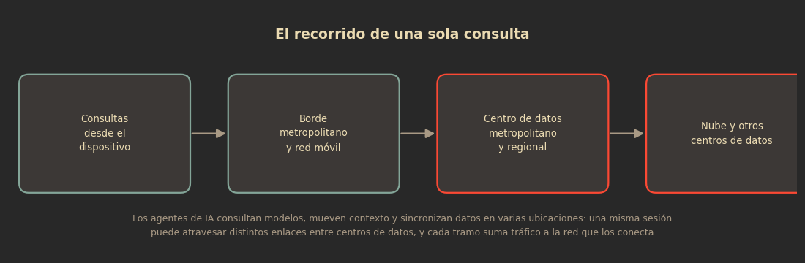
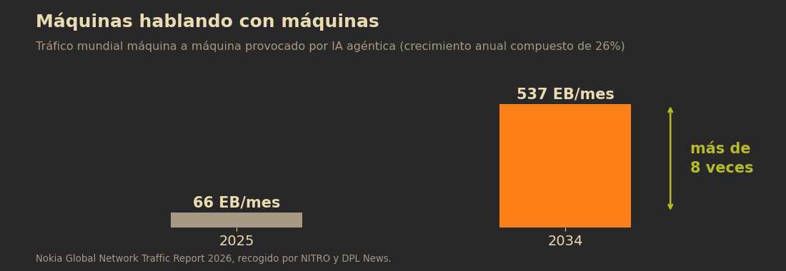

Cuando hablo de que trabajo en Core de voz, la gente imagina antenas. Pero hay una parte del negocio que casi nunca aparece en la conversación pública y que acaba de volverse mucho más interesante: la red que mueve los datos entre un lugar y otro.

La IA obligó a hablar de chips, de electricidad, de agua y de centros de datos. Casi nadie habla de lo que ocurre entre esos centros de datos, y ahí es donde está una de las partes más caras y menos visibles de todo el negocio.

Lo que me hizo aterrizarlo fue el Nokia Global Network Traffic Report 2026, un estudio elaborado por Bell Labs Consulting y presentado en América Latina a principios de septiembre. La conclusión central ya la repitieron varios medios: el tráfico de las redes WAN crecerá entre tres y siete veces hacia 2034. Lo que me parece más relevante está en el desglose.

## Lo que dice el informe

El escenario conservador estima que el tráfico global de las redes se triplicará hacia 2034; el agresivo, que podría crecer hasta siete veces. En cifras, eso significa entre 2,277 y 4,878 exabytes mensuales, con tasas de crecimiento anual compuesto de entre 13 y 22 por ciento según el escenario que se cumpla.

El video seguirá siendo el rey del tráfico de consumo, con entre 60 y 70 por ciento del volumen. Lo nuevo es la categoría que antes no existía en estos estudios: el tráfico generado por IA, que representaría alrededor de 30 por ciento del tráfico WAN y unos 921 exabytes mensuales en 2034.

Nokia distingue tres modalidades de IA que afectan el diseño de redes: la generativa, que espera una acción del usuario antes de responder; la agéntica o autónoma, que decide y ejecuta sin intervención humana; y la física, asociada a robots y vehículos autónomos que transmiten datos de forma constante. Las tres, con perfiles de tráfico muy distintos al que las redes aprendieron a transportar.

## Una consulta pesa 3.5 veces más de lo que parece

Aquí está el dato que me pareció más contundente, y el que menos se está discutiendo.

Según el desglose del informe que recoge NITRO, 921 exabytes mensuales de tráfico de inferencia generado desde los usuarios podrían traducirse en 3,260 exabytes mensuales circulando por los enlaces entre centros de datos. Es decir, aproximadamente 3.5 veces el volumen original, con un crecimiento anual compuesto de 20.3 por ciento hasta 2034.

¿Por qué se multiplica? Porque una consulta a un sistema de IA no termina en una respuesta local. Los agentes llaman modelos repetidamente, mueven contexto, sincronizan información y consultan datos que viven en distintas ubicaciones. Una misma sesión puede atravesar varios enlaces entre centros de datos, y cada tramo suma tráfico sobre la infraestructura que los conecta.

Ahí está la consecuencia que se nos escapa cuando discutimos si la IA es o no una burbuja: el tráfico no se queda dentro del centro de datos. Sale, regresa, se replica y se sincroniza. Y todo eso se transporta.

## Quién pone la infraestructura

El informe reparte ese volumen entre tres tipos de enlace, y el reparto dice mucho: 67.4 por ciento del tráfico circularía por infraestructura de operadores de telecomunicaciones; 23.8 por ciento iría por enlaces entre operadores y centros de datos de proveedores de nube; y 7 por ciento entre centros de datos de compañías de nube entre sí.

Déjenme leerlo en voz alta, porque es la parte que me toca: dos tercios del transporte de la IA recaería sobre redes de operadores. Los chips ejecutan los modelos y los centros de datos concentran el cómputo, pero los resultados tienen que viajar, y quien tiende la fibra, los enlaces ópticos, la capa IP y las interconexiones metropolitanas y regionales somos los operadores.

Durante años nos dijeron que nos estábamos convirtiendo en “tuberías tontas”: infraestructura que otros monetizan. Este informe sugiere que la tubería vuelve a ser crítica, pero no resuelve el problema de fondo, que es quién paga el tubo.

## Las máquinas empiezan a hablar entre ellas

El otro cambio de fondo no es cuánto tráfico hay, sino quién lo origina.

El informe proyecta que el tráfico mundial máquina a máquina provocado por IA agéntica pase de 66 exabytes mensuales en 2025 a 537 exabytes en 2034: más de ocho veces, con un crecimiento anual compuesto de 26 por ciento. En el segmento empresarial, el tráfico específicamente relacionado con IA crecería a una tasa anual compuesta de 48 por ciento hasta alcanzar 101 exabytes mensuales en 2034.

Ese tráfico tiene propiedades incómodas para una red diseñada para video: es más simétrico —durante años optimizamos la descarga y ahora buena parte del volumen sube—, requiere latencia ultrabaja y exige interconexión masiva. Dicho de otro modo, importa más el tiempo de respuesta que la velocidad del enlace.

De ahí que la arquitectura tenga que cambiar y no solo crecer. Santiago Escalona, director de Estrategia de Negocios para América Latina de Nokia, lo resumió en una frase que cualquier ingeniero de transporte entiende: “Necesitas fibra sí o sí. No hay opción”.

## Lo que esto significa para quien opera redes

El discurso de que la IA es un tema de software se cae en el momento en que ves el detalle de la arquitectura. El procesamiento se acerca al usuario —estaciones base con mini centros de datos en el borde, función que en mi mundo llamamos edge— no por moda, sino porque la latencia no se negocia. Y eso redistribuye el tráfico en vez de concentrarlo: del dispositivo a la estación base, de ahí a un centro de datos metropolitano, luego a uno regional y finalmente a la nube.

Para los operadores, eso significa tres frentes simultáneos: más capacidad en transporte y óptica, más interconexión entre redes y centros de datos, y redes de acceso con más simetría. Todo eso es capex, es planificación de capacidad a años vista y es gente que sepa hacerlo. Es, también, una oportunidad: por primera vez en mucho tiempo, el crecimiento del tráfico no viene del video que ya sabemos transportar, sino de un tipo de tráfico que obliga a rediseñar.

En América Latina el matiz es que la región suele enterarse tarde de estos cambios de arquitectura. Si el tráfico entre centros de datos se convierte en el segmento más dinámico de la próxima década, la pregunta para nuestra región no es cuánta IA vamos a consumir, sino cuánta infraestructura de transporte vamos a tener para que ese tráfico pase por aquí y no nos salte.

## La pregunta incómoda: ¿quién paga el transporte?

Y aquí conecto con lo que escribí hace unos días sobre los teléfonos de entrada que la IA está encareciendo. Son dos extremos de la misma cadena: la IA presiona el costo de la memoria en el dispositivo y presiona el costo de la infraestructura de transporte en la red. En el medio queda el usuario, y en los dos extremos queda alguien preguntándose de dónde sale el dinero.

No es un pleito de buenos contra malos, y quiero ser cuidadoso: los proveedores de nube invierten cantidades gigantescas en sus propios centros de datos y en sus propios enlaces, y ese 7 por ciento de tráfico entre nubes lo prueba. Pero el 67 por ciento que viaja por redes de operadores se sostiene con inversión de operadores que, en la mayoría de nuestros mercados, cobran por conectividad de consumo con márgenes bajo presión y compiten contra servicios que se montan sobre esa misma conectividad.

Si esa asimetría se mantiene, el resultado predecible es el que ya conocemos: menos inversión en los lugares donde no es rentable, o más presión sobre los precios de quien sí puede pagar. Y en nuestra región eso no es un detalle técnico, es la diferencia entre que la próxima década de infraestructura llegue a todos o llegue solo a los corredores rentables.

Tengo una opinión formada: el transporte de la IA es infraestructura crítica y merece el mismo debate de política pública que la cobertura móvil, porque sin transporte no hay IA, no hay nube y no hay servicios digitales. Pero es solo mi opinión, y me interesa la de ustedes: cuando el negocio de la IA vive en la nube y el costo del camino lo pagan las redes, ¿quién debería pagar el transporte?

El progreso no guiado por el humanismo no es progreso.

## Fuentes

- NITRO News, [La IA multiplicará el tráfico entre data centers y las telcos cargarán con el 67%](https://nitronews.mx/infraestructura/ia-trafico-data-centers-telcos-67-por-ciento/) (septiembre de 2026).
- NITRO News, [La IA generará el 30% del tráfico mundial y obligará a rediseñar las redes hacia 2034](https://nitronews.mx/telecomunicaciones/ia-trafico-wan-mundial-2034-nokia/) (septiembre de 2026).
- TeleSemana, [El video seguirá siendo rey pero la IA obligará a repensar el diseño de las redes hacia 2034](https://www.telesemana.com/blog/2026/09/07/el-video-seguira-siendo-rey-pero-la-ia-obligara-a-repensar-el-diseno-de-las-redes-hacia-2034/) (7 de septiembre de 2026).
- DPL News, [Nokia advierte que la Inteligencia Artificial impulsa el tráfico de redes entre 3 y 7 veces](https://dplnews.com/nokia-advierte-que-la-inteligencia-artificial-impulsa-el-trafico-de-redes-entre-3-y-7-veces/) (septiembre de 2026).
- MNI Noticias, [Tráfico global de las redes crecerá entre tres y siete veces en el 2034](https://mninoticias.com/trafico-global-de-las-redes-crecera-entre-tres-y-siete-veces-en-el-2034-nokia-global-network-traffic-report%E2%97%8F/) (3 de septiembre de 2026).

*Nota metodológica: el rango de crecimiento de tres a siete veces, los 2,277–4,878 exabytes mensuales, las tasas de 13–22 por ciento, el peso del video y las modalidades de IA están corroborados en las coberturas de MNI Noticias, DPL News y TeleSemana. Las cifras de desglose —921 exabytes de inferencia desde usuarios, 3,260 exabytes en enlaces entre centros de datos y el reparto de 67.4 / 23.8 / 7 por ciento— provienen de la cobertura de NITRO News del mismo informe; las cito atribuidas porque no las encontré replicadas en las otras notas.*

*Este artículo es la continuación de [El precio de entrar: cómo la IA está encareciendo los teléfonos más baratos](/blog/el-precio-de-entrar-como-la-ia-encarece-los-telefonos-mas-baratos/), sobre el mismo efecto visto desde el otro extremo de la cadena.*
